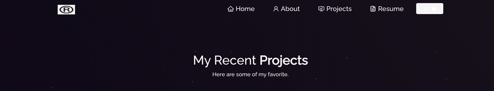
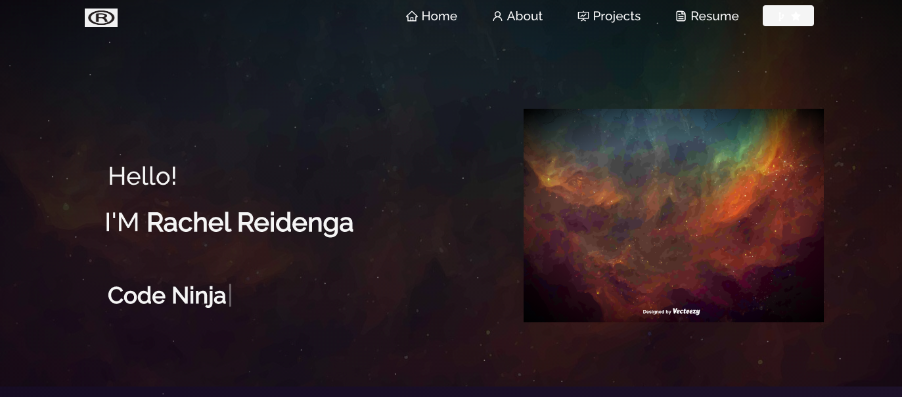
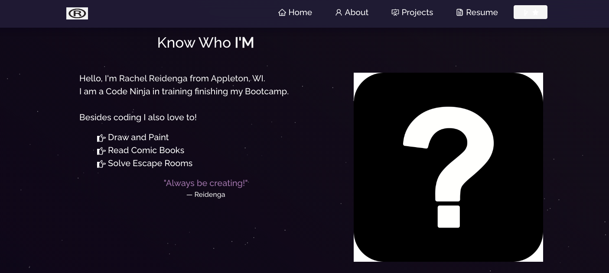
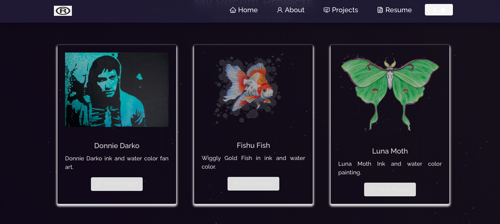
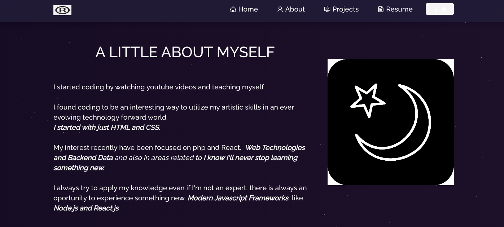
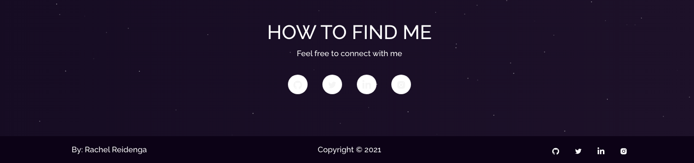
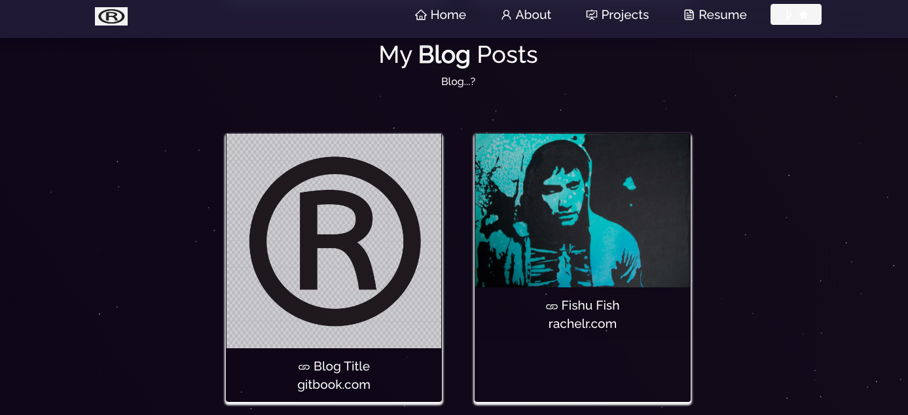

#  React Portfolio

## Table of Contents

* [Technologies](#technologies)

* [Credits](#contributing)

* [Questions](#questions)
  

## Link to React Portfolio

[Protfolio](https://rachel-reidenga.github.io/ReactPortfolio/)

## Images

  

## Technologies

* JavaScript
* Node
* React
* Mongoose

## Deployment

Link to repo on [GitHub](https://github.com/Rachel-Reidenga/ReactPortfolio/tree/master/portfolio)

### Background & Logo Images From

<a href="https://www.vecteezy.com/free-vector/grunge">Grunge Vectors by Vecteezy</a>

### Contributing

[w3schools.com](https://www.w3schools.com/)

[stackoverflow](https://stackoverflow.com/)

Shout out to Tanetta J, Monica H and Paul C

### Questions
If there are any questions please contact me [Rachel-Reidenga](https://github.com/Rachel-Reidenga) 

